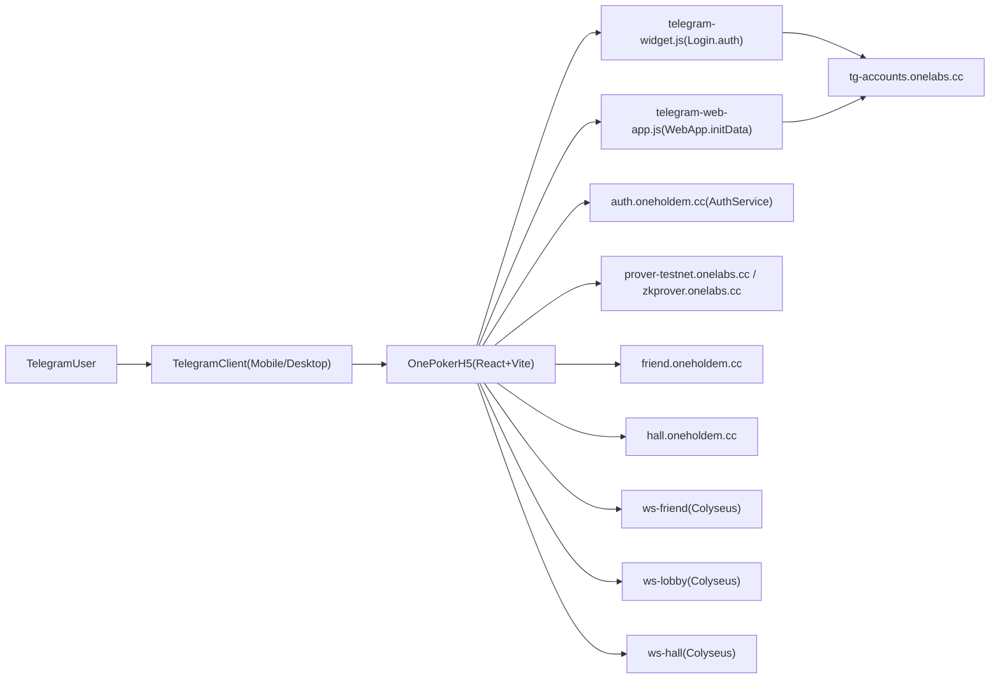
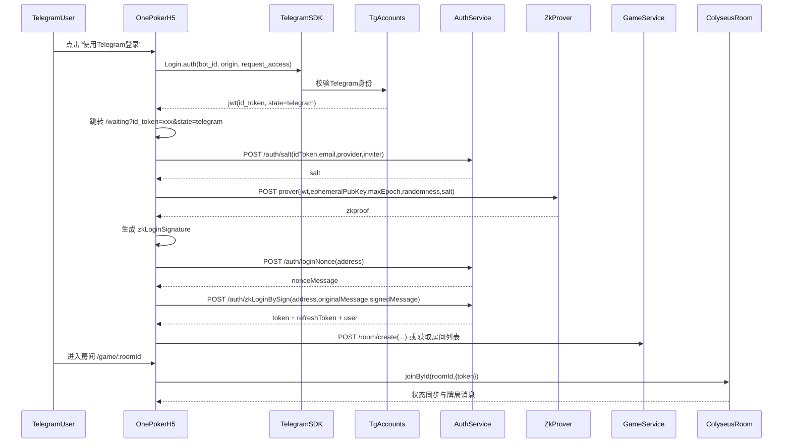
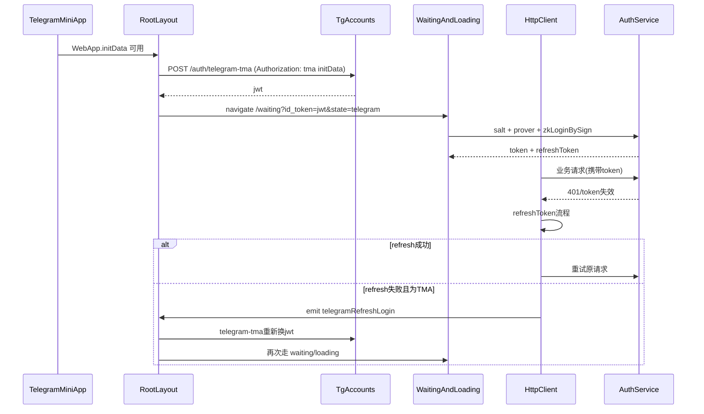

# Telegram 机器人登录并进入游戏技术方案

## 1. 背景与目标

本文档说明 OnePoker H5 在 Telegram 场景下，如何实现：

- 用户通过 Telegram Bot / MiniApp 完成登录。
- 登录后完成 zkLogin 证明与业务鉴权换 token。
- 进入大厅、建房/入房，并通过 WebSocket 开始游戏。
- token 过期后在 Telegram 场景自动恢复登录，尽量减少人工操作。

目标是形成一套可复用、可联调、可上线的端到端方案。

## 2. 现有实现落点（代码基线）

- Telegram 接入与 bot_id 解析：`src/server/telegram.ts`
- 登录页（Google/Apple/Telegram）：`src/routes/login/index.tsx`
- Telegram MiniApp 自动登录与 token 守卫：`src/layouts/RootLayout.tsx`
- OAuth 回调与 zkproof 生成：`src/routes/Waiting/index.tsx`
- nonce 签名换业务 token：`src/routes/HomeLoading/index.tsx`
- HTTP 鉴权与 refreshToken：`src/http/index.ts`、`src/http/rwaHttp.ts`
- 路由骨架：`src/routes.ts`
- 建房与进房：`src/routes/tables/MobilePage/ImdiatOpen.tsx`、`src/routes/lobby/components/table.tsx`
- 游戏容器与房间连接：`src/components/OnePokerGame/index.tsx`、`src/game/scenes/Main.ts`、`src/http/socket.ts`
- Bot 创建脚本：`scripts/create-tg-bot.mjs`、`scripts/create-tg-bot.sh`、`scripts/create-tg-bot.ps1`

## 3. 总体架构

### 3.1 角色职责

- Telegram JS SDK
  - `Login.auth`：网页登录弹窗授权。
  - `WebApp.initData`：MiniApp 场景提供已签名上下文。
- tg-accounts 服务
  - 校验 Telegram 身份，发放符合当前登录域的 JWT（作为 `id_token` 输入下一步 zkLogin）。
- Auth 服务
  - `salt`、`loginNonce`、`zkLoginBySign`、`refreshToken` 等业务鉴权流程。
- Prover 服务
  - 基于 JWT + 随机数 + epoch 生成 zk 证明。
- Game/Friend/Hall 服务
  - 房间管理、业务数据接口、Colyseus 房间事件同步。

## 4. 端到端时序

### 4.1 首次 Telegram 登录并进入游戏

### 4.2 MiniApp 自动登录与 token 过期恢复

## 5. 关键流程设计

### 5.1 登录入口与 bot_id 策略

- `getTelegramBotId()` 优先取 URL `?bot_id=xxx`，否则读取环境变量 `UMI_APP_TELEGRAM_BOT_ID`。
- 支持同一套前端被多个 Bot 复用，靠 URL 参数做动态区分。
- BotFather 的 MiniApp URL 需要带 `bot_id`，例如：`https://<domain>?bot_id=8756595222`。

### 5.2 双通道登录策略

- 通道 A（网页按钮登录）
  - `window.Telegram.Login.auth` -> `telegram-auth` 接口换 `jwt` -> 跳转 `/waiting`。
- 通道 B（MiniApp 自动登录）
  - `window.Telegram.WebApp.initData` -> `telegram-tma` 接口换 `jwt` -> 跳转 `/waiting`。

价值：

- 兼容 Telegram 外浏览器和 Telegram 内嵌容器两种入口。
- token 失效时在 MiniApp 内可自动恢复，不强制回 `/login`。

### 5.3 zkLogin 与业务登录桥接

在 `/waiting` + `/loading` 两段完成：

1. `id_token` 解码，获取 `sub/email/aud`。
2. 调 `/auth/salt` 获取用户 salt。
3. 结合本地 `ephemeral key pair + randomness + maxEpoch` 调 prover 生成 zkproof。
4. 由地址向 auth 申请 `loginNonce`。
5. 用临时私钥签 nonce，组装 zkLoginSignature，调 `/auth/zkLoginBySign`。
6. 落地 `holdem-token`、`holdem-http-refreshToken`、`holdem-user`，进入首页。

### 5.4 进入游戏

- 创建房间：`POST /room/create` 后 `navigate(/game/:roomId)`。
- 大厅入房：`navigate(/game/:roomId, { state: { clientUrl: hallGameClientUrl } })`。
- 游戏连接：
  - `Main.connect()` 使用 `holdem-token` 执行 `joinById`。
  - 失败时先尝试 `reconnectToken`，再 fresh connect，最多重试 3 次。
  - 成功后持续接收 `ttable_*` 消息并驱动 UI 与状态机。

## 6. 接口契约（建议）

以下为前端依赖的关键接口语义，字段名以当前调用代码为准。

### 6.1 `POST /auth/telegram-auth`

- 调用方：`src/server/telegram.ts` -> `telegramAuth()`
- 用途：网页登录模式，提交 Telegram 用户授权对象，换平台 JWT。
- 请求体（示意）：
  - `initData`: Telegram user object
  - `botId`: string
  - `nonce`: string
- 响应关注：
  - `data.data.jwt`

### 6.2 `POST /auth/telegram-tma`

- 调用方：`src/server/telegram.ts` -> `telegramTma()`
- 用途：MiniApp 模式，凭 `initData` 直接换 JWT。
- 请求头：
  - `Authorization: tma <initData>`
- 请求体：
  - `botId`: string
  - `nonce`: string
- 响应关注：
  - `data.data.jwt`

### 6.3 `POST /auth/salt`

- 调用方：`src/routes/Waiting/index.tsx`
- 用途：获取用户盐值，作为 `jwtToAddress` 与 zkLogin 证明输入。
- 请求体（示意）：
  - `idToken`
  - `email`
  - `provider`（`telegram|google|apple`）
  - `inviter`
- 响应关注：
  - `data.data.salt`

### 6.4 `POST /auth/loginNonce`

- 调用方：`src/routes/HomeLoading/index.tsx`
- 用途：获取待签名 nonce，防重放。
- 请求体：
  - `address`
- 响应关注：
  - `data.data.nonce`

### 6.5 `POST /auth/zkLoginBySign`

- 调用方：`src/routes/HomeLoading/index.tsx`
- 用途：提交 zkLogin 签名结果，换业务 token。
- 请求体（示意）：
  - `address`
  - `originalMessage`
  - `signedMessage`
- 响应关注：
  - `data.data.token`
  - `data.data.refreshToken`
  - `data.data.user`

### 6.6 `POST /auth/refreshToken`

- 调用方：`src/http/index.ts`、`src/http/rwaHttp.ts`
- 用途：业务 token 刷新。
- 失败兜底：
  - Telegram MiniApp：触发 `telegramRefreshLogin` 自动走 `telegram-tma`。
  - 非 Telegram 环境：跳转 `/login`。

## 7. 前端状态与存储模型

### 7.1 localStorage

- `holdem-token`：业务 access token
- `holdem-http-refreshToken`：refresh token
- `holdem-user`：用户信息
- `holdem-auth-provider`：登录来源（含 `telegram`）
- `inviter`：邀请参数（含 `start_param` 透传）
- `onePoker_max_epoch_key_pair`：zkLogin 最大 epoch
- `onePoker_zklogin_expire_end`：zkLogin 过期时间
- `zkloginData` / `isZkLogin`：redux 持久态

### 7.2 sessionStorage

- `onePoker_ephemeral_key_pair`：临时私钥
- `onePoker_randomness_key_pair`：随机数
- `onepoker:game-room`：房间重连 token map

### 7.3 状态流转要点

- `/login` 负责发起外部身份登录。
- `/waiting` 负责 zkproof 与地址生成。
- `/loading` 负责 nonce 签名换业务 token 并写入登录态。
- `RootLayout` 负责 token 守卫与 Telegram 自动恢复。

## 8. 配置与部署方案

## 8.1 必要环境变量

- `UMI_APP_TELEGRAM_BOT_ID`
- `UMI_APP_BASE_URL2`（Auth）
- `UMI_APP_GET_SALT_URL`
- `UMI_APP_OCT_PROVER_ENDPOINT`
- `UMI_APP_OCT_RPC_URL`
- `UMI_APP_BASE_URL` / `UMI_APP_BASE_URLHALL`
- `UMI_APP_SOCKET_FRIEND` / `UMI_APP_SOCKET_LOBBY` / `UMI_APP_SOCKET_HALL`

参考配置文件：

- `.env.development`
- `.env.test`
- `.env.production`

### 8.2 Telegram Bot 初始化

可使用脚本创建 bot 记录：

- `npm run create-tg-bot -- <appName> <botName> <botToken>`

或：

- `scripts/create-tg-bot.sh`
- `scripts/create-tg-bot.ps1`

### 8.3 BotFather 配置建议

- MiniApp URL 指向 H5 域名并附带 `bot_id`。
- 登录域名与回调域名应与线上 H5 域名一致，避免 `origin` 不匹配。

## 9. 安全设计要点

### 9.1 防伪造与防重放

- `telegram-tma` 必须在服务端校验 Telegram `initData` 签名与时效。
- `loginNonce` 一次一用，签名后立即失效。
- `maxEpoch` 控制 zkLogin 有效窗口，过期后触发重新登录。

### 9.2 token 生命周期

- Access token 短期有效，refresh token 中期有效。
- 刷新失败时清理本地登录态，Telegram 场景自动回登，Web 场景回登录页。

### 9.3 最小化敏感暴露

- 前端不保存 bot token。
- 临时私钥仅在 sessionStorage，关闭会话后失效。
- 日志禁止输出完整 token / 签名原文。

## 10. 异常场景与降级策略

### 10.1 Telegram SDK 脚本加载失败

- 现状：`console.error("Telegram login script not loaded")`。
- 建议：统一弹窗提示 + 重试入口 + 埋点。

### 10.2 `telegram-auth` / `telegram-tma` 失败

- 建议区分错误码：
  - `initData` 过期
  - `bot_id` 不匹配
  - 服务器签名校验失败
- UI 提示用户重新打开 MiniApp。

### 10.3 prover 或 `/auth/salt` 失败

- 现状：跳转 `/login` 并提示“登录异常”。
- 建议：增加失败类型提示，降低“统一登录异常”排障成本。

### 10.4 token 刷新失败

- 已有：TMA 自动恢复；非 TMA 跳登录页。
- 建议：增加重试次数上限与节流，避免短时间重复触发。

### 10.5 WebSocket 入房失败

- 已有：reconnect -> connect -> 最多重试 3 次。
- 建议：区分 `invalid token` 与网络抖动，分别走“重新鉴权”或“重连提示”。

## 11. 联调与验收清单

### 11.1 功能联调清单

- Telegram 内打开 MiniApp，无 token 时自动登录成功。
- 登录按钮路径（`Login.auth`）可得到 `id_token` 并进入 `/waiting`。
- `/waiting` 完成 zkproof，`/loading` 完成 `zkLoginBySign`。
- 成功落地 `holdem-token`、`holdem-http-refreshToken`、`holdem-user`。
- 可正常建房并进入 `/game/:roomId`。
- 大厅房间可通过 `hallGameClientUrl` 正常连接。

### 11.2 异常联调清单

- 强制让 token 失效，验证自动 refresh 与 TMA 自动回登。
- 模拟 `prover` 超时，验证页面提示与回退路径。
- 模拟 `ws` 断开，验证 reconnect token 恢复行为。

### 11.3 可观测性清单

- 登录关键节点日志：`telegram_auth_start/success/fail`。
- zkLogin 关键节点日志：`salt_request`、`zkproof_request`、`zklogin_signin`。
- WebSocket 关键节点日志：`join_room_start/success/fail`。
- 日志字段建议统一包含：`provider`、`playerId`、`roomId`、`traceId`。

## 12. 当前实现风险与优化建议

### 12.1 风险

- 登录页里挂载了 `data-callback="telegramAuthCallback"` 脚本，但主流程实际用 `Telegram.Login.auth`，两套模式并存可能导致维护混淆。
- 多处 `console.log/error` 与结构化日志并存，线上排障口径不一致。
- 失败分支对用户提示较粗（统一“登录异常”），不利于定位是网络、签名还是配置问题。

### 12.2 优化建议（按优先级）

1. 收敛 Telegram 登录入口，只保留主通道并移除无效 callback 代码。
2. 抽象 `TelegramAuthService`，统一处理 `bot_id`、SDK ready、接口调用、错误码映射。
3. 统一日志规范（关键链路全部使用结构化日志函数，不使用裸 `console`）。
4. 增加 e2e 用例：
   - `telegram-web-login-success`
   - `telegram-tma-auto-login-success`
   - `token-expired-tma-relogin-success`
5. 对接口返回码建立文档化错误字典，前端按错误码展示明确文案。

## 13. 最终落地路径建议

- 文档版本：`v1.0`
- 先完成联调环境闭环：
  - bot 配置 -> 登录 -> zkLogin -> 业务 token -> 建房入房 -> websocket 同步
- 再上线可观测性增强与错误分级提示，降低线上故障恢复时间。
